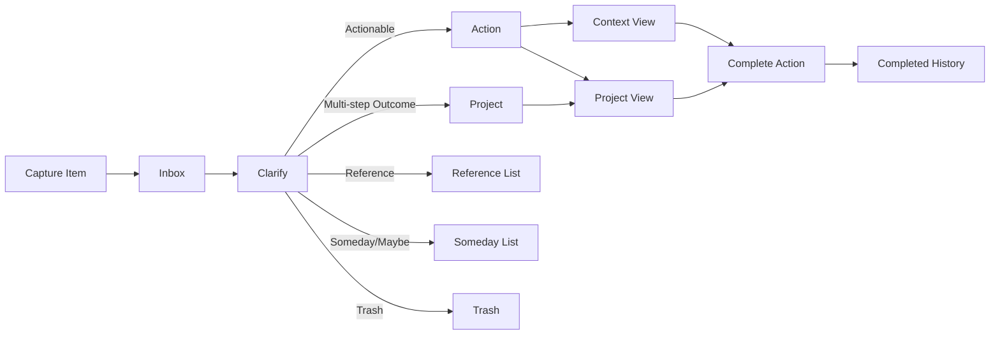

## GTD-Inspired Task Manager PRD

### 1. Product Summary & Background

#### 1.1 Problem Statement

Individual knowledge workers and students juggle dozens of tasks, ideas, and small projects across many channels (email, chat, notes, sticky notes, calendar). Existing tools either feel too heavy and complex (full GTD suites, project management platforms) or too shallow (simple to‑do lists) for maintaining a trustworthy system that supports both capture and clear execution. As a result, people accumulate large, fuzzy backlogs, lose track of next actions, and experience anxiety about what might be falling through the cracks.

The problem is not a lack of tools but a lack of a simple, opinionated workflow that helps users move reliably from capture to clear next actions, with just enough structure (projects, contexts) and without the overhead of full GTD rigor.

#### 1.2 Target Users & Context

- **Primary audience**: Individual knowledge workers (e.g., software engineers, product managers, consultants, freelancers) managing their own tasks and small projects.
- **Secondary audience**: Students and makers managing coursework, side projects, and personal commitments.
- **Usage context**:
  - Desktop‑first responsive web app; mobile‑friendly for quick capture and review.
  - Single‑user accounts only; no shared workspaces, team views, or collaboration features in v1.

#### 1.3 Why Existing Tools Fall Short

- **Overly complex GTD or project tools**:
  - Require heavy configuration and ongoing maintenance (tags, custom fields, multiple boards).
  - Attempt to model full GTD (tickler files, horizons of focus, detailed reviews), overwhelming new users.
- **Simple to‑do apps**:
  - Provide flat lists with limited structure; projects and contexts, if present, are often bolted on.
  - Offer poor support for clarification (deciding whether an item is actionable, what the next action is, or where it belongs).
- **Generic productivity platforms (e.g., generic boards, docs)**:
  - Flexible but unopinionated; users must design their own workflows and conventions.

The result is either **friction at the front door (capture/clarify)** or **cluttered backlogs that don’t guide daily execution**.

#### 1.4 Proposed Solution (High-Level)

Provide a **lightweight GTD‑inspired task manager** centered on four core concepts:

1. **Captured Item**: Anything the user quickly throws into the system (ideas, tasks, emails to handle, reminders).
2. **Action**: A clearly defined, actionable next step that can be done in a single session.
3. **Project**: A desired outcome requiring multiple actions.
4. **Context**: The situation or resource required to execute an action (e.g., “At Computer”, “Errands”, “Calls”).

The app will:

- Make **capture and quick add extremely low friction**.
- Provide a simple **clarify view** to turn captured items into actions or projects (or mark as reference or trash).
- Offer **organized views** by project and by context.
- Focus execution around **context‑centric lists** with simple filters for time, energy, and due date.

#### 1.5 GTD Inspiration and Adaptation (Lightweight Approach)

The app draws from GTD’s core loop (capture → clarify → organize → execute) but intentionally **omits** advanced GTD constructs and rigorous review rituals in v1. The design aims for:

- Minimal fields and explicit defaults.
- A small number of views that map directly to user intent (inbox, clarify, projects, contexts, today).
- Clear, opinionated transitions for items (captured → action, project, reference, or trash).

There is **no full weekly review, tickler file, or horizons of focus** in v1; those are treated as potential future enhancements.

---

### 2. Goals and Non-Goals

#### 2.1 Primary Product Goals (v1)

1. **Frictionless capture**: Users can add items to the system in under 5 seconds from any main view.
2. **Clear next actions**: Every actionable item can be represented as a concrete action with context and (optionally) project and due date.
3. **Simple project structure**: Users can create projects and see all associated actions, ensuring no project is stuck without a visible next action.
4. **Context‑based execution**: Users can work from context views (e.g., “At Computer”, “Errands”), trusting those lists to show only relevant, available actions.
5. **Trustworthy single‑user system**: Individual users can rely on the app as the single source of truth for their personal tasks and small projects.

#### 2.2 Secondary / Nice-to-Have Goals

1. **Lightweight personal metrics** (e.g., number of completed actions per day) without detailed analytics.
2. **Personalization of contexts** (renaming, adding, hiding) while preserving a minimal, sensible default set.
3. **Keyboard‑friendly interactions** for power users (e.g., quick add, navigate between views).

#### 2.3 Non-Goals and Explicit Exclusions for v1

1. **Team collaboration**: No shared projects, shared lists, comments, mentions, or multi‑user workspaces.
2. **Calendar and email integration**: No direct calendar sync, email import, or bi‑directional integration.
3. **Full GTD review system**: No weekly review flows, horizons of focus, or tickler file.
4. **Automation and rules engines**: No if‑this‑then‑that rules, automatic rescheduling, or recurring tasks beyond simple due‑date use.
5. **Native mobile apps**: Mobile support is via responsive web only.

Collectively, sections 2.1–2.3 define the **explicit v1 scope boundary**: functionality that directly supports frictionless capture, clarification into actions/projects, lightweight organization, and context‑based execution **for a single individual user** is in scope; anything listed as a non‑goal here (and reiterated in section 8) is explicitly out of scope for v1.

---

### 3. User Personas & Key Use Cases

#### 3.1 Persona A: Busy Knowledge Worker

##### 3.1.1 Goals and Pain Points

- **Goals**:
  - Keep track of work tasks, personal errands, and side projects in one place.
  - Always know the next meaningful action for important projects.
  - Reduce anxiety about forgetting commitments made in meetings or over email.
- **Pain points**:
  - Current tools are split (email, tickets, notes, sticky notes).
  - Existing project management tools feel too heavy for personal work.
  - Flat to‑do lists grow long and noisy; it’s hard to see what matters now.

##### 3.1.2 Typical Work Patterns

- Works primarily on a laptop during business hours.
- Receives many inputs via email, chat, and meetings.
- Has 5–15 active projects at any given time.
- Switches frequently between deep work and quick administrative tasks.

#### 3.2 Persona B: Student / Maker

##### 3.2.1 Goals and Pain Points

- **Goals**:
  - Track assignments, exams, and project milestones across multiple courses.
  - Keep personal and side‑project tasks in the same trusted system.
  - Avoid last‑minute surprises by seeing upcoming work in context.
- **Pain points**:
  - Course management systems only track school work, not personal or side projects.
  - Simple reminders apps don’t express multi‑step projects well.
  - Feels overwhelmed when lists mix trivial tasks with important deadlines.

##### 3.2.2 Typical Work Patterns

- Alternates between study sessions, classes, and making/building time.
- Uses a mix of laptop and mobile.
- Has bursts of capture (after class, during brainstorming) and short windows to clarify/organize.

#### 3.3 Core Use Cases (Across Personas)

##### 3.3.1 Capture Tasks and Ideas

- Jot down a task, idea, or reminder with minimal friction (from inbox or quick‑add).
- Capture items without needing to decide immediately whether they are actionable.

##### 3.3.2 Clarify and Decide Next Actions

- Review captured items one by one and decide:
  - Is it actionable?
  - If yes, what is the next action?
  - Does it belong to an existing project, or should it become a new project?
  - If not actionable, should it become reference, someday/maybe, or be trashed?

##### 3.3.3 Organize into Projects and Contexts

- Group related actions under projects to represent meaningful outcomes.
- Attach contexts to actions so they appear in relevant execution lists.

##### 3.3.4 Execute from Context-Based Views

- Work from a context view (e.g., “At Computer”) and see only actions that:
  - Match the current context.
  - Are not completed or trashed.
  - Optionally, are due soon or tagged with appropriate time/energy levels.

---

### 4. User Journeys / Flows

#### 4.1 End-to-End Lifecycle Overview

1. User has an idea or task in mind.
2. User quickly **captures** it into the inbox.
3. Later, user enters a **clarify** mode to process inbox items one at a time.
4. The item is:
  - Turned into an **Action** (with context and optional project, due date), or
  - Elevated to a **Project** (with at least one initial next action), or
  - Stored as **Reference/Someday** or **trashed**.
5. Actions appear in **project views** and **context views**.
6. User **executes** from a context list, marking actions complete as they are done.

#### 4.2 Capture Flow

##### 4.2.1 Trigger and Entry Points (Inbox, Quick Add)

- From any main view, the user can:
  - Use a prominent “+ Capture” control to open a lightweight capture form.
  - Type into an inbox “quick add” field at the top of the inbox view.
- Keyboard shortcuts (e.g., a global “add” shortcut within the app) should support fast capture.

##### 4.2.2 Minimal Fields and Defaults

- Capture form focuses on:
  - **Title** (required).
  - **Notes** (optional, multiline).
  - Optional pre‑assignment for **project**, **context**, and **due date** (defaults to none).
- Captured items default to **inbox** status until clarified.

#### 4.3 Clarify Flow

##### 4.3.1 Turning Captured Items into Actions or Projects

- A dedicated clarify mode presents one inbox item at a time with controls to:
  - Convert to an **Action**:
    - Set or edit title, notes.
    - Optionally assign project, context, due date, time/energy hints.
  - Convert to a **Project**:
    - Create a project from the item (project name derived from item title by default).
    - Optionally seed one or more initial next actions.

##### 4.3.2 Handling Reference Material and Trash

- For non‑actionable items, user can:
  - Mark as **Reference** (kept in the system but excluded from action lists).
  - Mark as **Someday/Maybe** (kept in a dedicated someday list for future review).
  - **Delete/Trash** the item (soft delete; can be recovered for a limited time or permanently removed).

##### 4.3.3 Constraints on Actionable Items

- An item is only considered an **Action** if:
  - It describes a concrete, single step that can be completed in one work session.
  - It is not blocked by other uncompleted work that should instead be represented as a Project.
- Clarify UI should encourage splitting vague or multi‑step items into:
  - One **Project** plus one or more **Actions**, or
  - Multiple clear **Actions** if they are independent.

#### 4.4 Organize Flow

##### 4.4.1 Assigning Projects and Contexts

- When creating or editing actions, users can:
  - Attach an action to zero or one project.
  - Assign zero or one primary context (with potential for a future enhancement to support multiple contexts).
- Default context and project can be left blank to keep capture/clarify fast.
- Actions without a context DO NOT appear in context‑based execution lists.

##### 4.4.2 Navigating Projects and Their Actions

- From a **Projects** view, users can:
  - See a list of all projects with key metadata (e.g., number of open actions, completion status).
  - Drill into a specific project to view:
    - Open actions.
    - Completed actions (collapsed by default).
  - Identify if a project has **no next action** and prompt the user to add one.

##### 4.4.3 Viewing Actions by Context

- From a **Contexts** view, users can:
  - See a list of defined contexts.
  - Select a context to view all open actions tagged with that context, sorted and filterable by due date, time/energy, or project.

#### 4.5 Execute Flow

##### 4.5.1 Context-Centric Views

- The primary execution interface is a context list where:
  - The user selects the current context (e.g., “At Computer”).
  - The app displays all matching open actions, with optional grouping by project.

##### 4.5.2 Simple Filters (time, energy, due date)

- Within a context list, the user can:
  - Filter by **time available** (e.g., “< 15 minutes”, “15–60 minutes”, “> 60 minutes”).
  - Filter by **energy level** (e.g., “Low”, “Medium”, “High”).
  - Filter or sort by **due date** (e.g., overdue, due today, upcoming).

##### 4.5.3 Completing Actions

- Users can mark actions as complete from:
  - Context views.
  - Project views.
  - Action detail panels.
- Completed actions:
  - Leave context and project lists but remain accessible via history or “completed” filters.
  - May trigger project‑level status indicators (e.g., project progress).

#### 4.6 Flow Diagram

##### 4.6.1 Mermaid Diagram: Item Lifecycle from Capture to Completion

---

### 5. Functional Requirements

#### 5.1 Capture

##### 5.1.1 Inbox and Quick Add

- Provide a dedicated **Inbox** view listing all unclarified captured items.
- Provide a **quick add** input visible in the inbox and accessible via a primary “+” control elsewhere.

##### 5.1.2 Required and Optional Fields

- Required field for capture:
  - Title (short text).
- Optional fields:
  - Notes (long text).
  - Project (single select from existing projects, or none).
  - Context (single select from existing contexts, or none).
  - Due date (date, optional).

##### 5.1.3 Testable Requirements (Numbered List)

1. The system SHALL allow a user to create a captured item with only a title in ≤ 5 seconds from any main view.
2. The system SHALL store all newly captured items in the inbox until they are clarified.
3. The system SHALL allow users to optionally set notes, project, context, and due date at capture time.
4. The system SHALL display newly captured items at or near the top of the inbox list by default.
5. The system SHALL be accessible via a keyboard shortcut to open the capture form from any main view.

#### 5.2 Clarify

##### 5.2.1 Rules for Converting Captured Items

- Clarify mode presents one item at a time and offers explicit actions:
  - Convert to Action.
  - Convert to Project.
  - Mark as Reference.
  - Mark as Someday/Maybe.
  - Move to Trash.

##### 5.2.2 Handling Non-Actionable Items (Reference, Someday, Trash)

- Reference and Someday/Maybe items:
  - Are removed from the inbox.
  - Do not appear in action or context lists.
  - Are accessible via separate reference/someday views or filters.
- Trashed items:
  - Are removed from all primary views.
  - Are accessible only via a Trash view until permanently deleted.

##### 5.2.3 Testable Requirements (Numbered List)

1. The system SHALL provide a clarify mode that allows a user to process inbox items sequentially without leaving the view.
2. The system SHALL allow a user to convert a captured item into an Action in a single interaction flow.
3. The system SHALL allow a user to convert a captured item into a Project in a single interaction flow.
4. The system SHALL ensure that items marked as Reference, Someday/Maybe, or Trash are not shown in action or context views.
5. The system SHALL update the inbox count when an item is clarified (i.e., removed from the inbox).

#### 5.3 Organize

##### 5.3.1 Projects and Their Structure

- Users can create, rename, archive, and browse projects.
- Each project has:
  - A name.
  - Optional description/notes.
  - Zero or more associated actions.

##### 5.3.2 Linking Actions to Projects and Contexts

- Actions may be:
  - Linked to zero or one project.
  - Linked to zero or one context (in v1).

##### 5.3.3 Navigation and Views (By Project, By Context)

- **By Project**:
  - List of projects with key statistics (e.g., number of open actions).
  - Project detail view with actions grouped by status (open vs. completed).
- **By Context**:
  - List of contexts.
  - Context detail view listing open actions for that context.

##### 5.3.4 Testable Requirements (Numbered List)

1. The system SHALL allow a user to create, rename, and archive projects.
2. The system SHALL allow a user to link an action to a project from both the project view and the action detail view.
3. The system SHALL allow a user to assign a context to an action from the action creation/editing interface.
4. The system SHALL provide a Projects view that lists all projects and their count of open actions.
5. The system SHALL provide a Contexts view that lists all contexts and allows navigation to each context’s actions.

#### 5.4 Execute

##### 5.4.1 Context Views (e.g., “At Computer”, “Errands”)

- Provide a default set of contexts (e.g., “At Computer”, “Errands”, “Calls”, “Home”), which users can modify within reasonable limits.

##### 5.4.2 Filters and Sorting (Due Date, Time/Energy, Status)

- Within any context view, users can:
  - Filter actions by time estimate bucket and energy level.
  - Sort actions by due date (overdue first, then due soon).

##### 5.4.3 Marking Actions Done and Feedback

- Users can mark actions as complete via checkboxes or similar controls.
- The UI should provide lightweight visual feedback (e.g., strikethrough + subtle animation) and remove items from active lists.

##### 5.4.4 Testable Requirements (Numbered List)

1. The system SHALL provide at least one default context view pre‑configured at first login.
2. The system SHALL allow users to mark an action as complete from a context view with a single click/tap.
3. The system SHALL remove completed actions from default active context views while keeping them accessible via a completed filter.
4. The system SHALL allow filtering of actions in a context view by time estimate bucket and energy level.
5. The system SHALL allow sorting actions in a context view by due date, placing overdue items first.

#### 5.5 Account & Session Basics (Single-User)

##### 5.5.1 Sign Up / Sign In / Sign Out

- Users can:
  - Create an individual account.
  - Sign in with email + password (or equivalent basic auth mechanism).
  - Sign out from any device.

##### 5.5.2 Basic Profile / Settings (if any in v1)

- Users can:
  - Update display name.
  - Configure basic settings such as default context and time zone.

##### 5.5.3 Testable Requirements (Numbered List)

1. The system SHALL allow a new user to create an account with a unique email and password.
2. The system SHALL require authentication for access to any user’s tasks, projects, or contexts.
3. The system SHALL allow an authenticated user to sign out, terminating the current session.
4. The system SHALL ensure that user tasks, projects, and contexts are not visible to any other user.
5. The system SHALL allow a user to update basic profile settings (e.g., display name, time zone).

---

### 6. Data Model & Domain Concepts

#### 6.1 Conceptual Domain Model Overview

The conceptual model consists of four primary entities:

1. **Captured Item**: Raw inputs captured into the inbox.
2. **Action**: Concrete next steps derived from captured items or directly created.
3. **Project**: Outcomes that require multiple actions.
4. **Context**: Situational categories that enable context‑based execution.

Captured Items are transformed into Actions, Projects, Reference, Someday/Maybe, or Trash. Actions may belong to a Project and are tagged with a Context.

#### 6.2 Entity: Captured Item

##### 6.2.1 Definition and Purpose

A Captured Item is any raw input the user adds to the system without yet deciding what it means or how to act on it. It represents an entry in the inbox awaiting clarification.

##### 6.2.2 Key Attributes

- ID
- Title
- Notes
- Created timestamp
- Optional preliminary project reference
- Optional preliminary context reference
- Optional due date
- Status (e.g., Inbox, Clarified → mapped to Action/Project/Reference/Someday/Trash)

#### 6.3 Entity: Action

##### 6.3.1 Definition and Purpose

An Action is a single, executable step that can be completed in one work session. It is the primary unit of execution in the system.

##### 6.3.2 Key Attributes

- ID
- Title
- Notes
- Status (e.g., Open, Completed, Archived)
- Created and completed timestamps
- Optional project reference (0..1 Project)
- Optional context reference (0..1 Context; actions without a context will not appear in context‑based execution lists)
- Optional due date
- Optional time estimate bucket (e.g., <15 min, 15–60 min, >60 min)
- Optional energy level (Low, Medium, High)

#### 6.4 Entity: Project

##### 6.4.1 Definition and Purpose

A Project is a desired outcome that requires more than one action to complete. It groups actions toward a common goal.

##### 6.4.2 Key Attributes

- ID
- Name
- Description/notes
- Status (e.g., Active, Archived, Completed)
- Created and completion timestamps
- List of associated actions (0..N Actions)

#### 6.5 Entity: Context

##### 6.5.1 Definition and Purpose

A Context captures the environment, tools, or situation required to execute an action.

##### 6.5.2 Key Attributes

- ID
- Name (e.g., “At Computer”, “Errands”, “Calls”)
- Optional description
- Active flag (to hide rarely used contexts)

#### 6.6 Relationships Between Entities

##### 6.6.1 Captured Item → Action / Project / Reference / Trash

- Each Captured Item is eventually resolved into exactly one of:
  - One or more Actions (possibly with linked Project).
  - A new Project (with optional linked initial Actions).
  - A Reference record.
  - A Someday/Maybe record.
  - Trash (deleted).

##### 6.6.2 Projects ↔ Actions

- A Project can have zero or many Actions.
- An Action can belong to zero or one Project.

##### 6.6.3 Actions ↔ Contexts

- Each Action must have one Context in v1.
- A Context can be associated with many Actions.

#### 6.7 Implementation View (High-Level, Tech-Agnostic)

##### 6.7.1 Likely Storage Structures

- Store entities as separate collections/tables for:
  - Users
  - Captured Items
  - Actions
  - Projects
  - Contexts
- Use soft deletion flags for trash/reference/someday where appropriate to avoid data loss.

##### 6.7.2 IDs and Linking Strategy

- Use stable unique IDs (e.g., UUIDs) for all entities.
- Use foreign keys or references for:
  - Action → Project
  - Action → Context
  - Captured Item → resulting Action(s)/Project/Reference/Someday (via reference fields or mapping table).

---

### 7. Non-Functional Requirements

#### 7.1 UX Principles

##### 7.1.1 Low-Friction Capture

- Capture should be achievable with minimal clicks/taps and fields.

##### 7.1.2 Clarity Over Configuration

- Defaults and flows should be opinionated; configuration options are intentionally limited to avoid complexity.

##### 7.1.3 Sensible Defaults and Minimal Cognitive Load

- Provide a small, curated set of default contexts and views.
- Avoid exposing advanced options in primary flows; keep the main path simple and obvious.

#### 7.2 Performance & Scalability (Single-User SaaS)

##### 7.2.1 Expected Data Volumes and Response Times

- The system is optimized for individual users with:
  - Up to tens of thousands of actions/captured items.
  - Up to hundreds of projects and contexts.
- For typical operations (loading inbox, context view, or project view), median response time SHOULD be under 200 ms server‑side under normal load.

##### 7.2.2 Offline / Latency Considerations (if any)

- v1 does not require full offline support.
- The UI should handle transient network errors gracefully (e.g., non‑blocking toasts, retry options).

#### 7.3 Security & Privacy

##### 7.3.1 Authentication and Session Management (High-Level)

- Require authentication for all access to user data.
- Use secure session management (e.g., HTTP‑only cookies or secure tokens) with reasonable session expiration.

##### 7.3.2 Data Protection and Privacy Baselines

- All communication SHOULD be encrypted in transit (HTTPS).
- User data SHOULD be stored using industry‑standard security practices.
- Data access MUST be scoped per user; no cross‑user data visibility.

#### 7.4 Reliability & Availability

##### 7.4.1 Data Durability Expectations

- Use persistent storage with backups or snapshots sufficient to restore user data in case of system failure.
- Trash and soft‑deleted entities SHOULD be restorable for a limited retention period (to be defined at implementation time).

##### 7.4.2 Error Handling Principles

- Errors should be surfaced to the user in clear, non‑technical language.
- Critical failures should not silently drop user input; in failure scenarios, capture attempts should either succeed or clearly inform the user to retry.

---

### 8. Out of Scope & Future Considerations

#### 8.1 Out-of-Scope for v1

##### 8.1.1 Team Collaboration and Shared Workspaces

- No shared projects, shared lists, commenting, or multi‑user workspaces in v1.

##### 8.1.2 Calendar and Email Integrations

- No direct calendar sync (e.g., Google Calendar, Outlook) or email import/processing flows in v1.

##### 8.1.3 Full GTD Review System (Weekly, Horizons of Focus, etc.)

- No dedicated weekly review workflows, horizons of focus, or tickler files in v1.

##### 8.1.4 Advanced Automations and Integrations

- No rules engines, recurring tasks beyond basic dates, or integrations with third‑party tools (e.g., Slack, issue trackers) in v1.

#### 8.2 Future Iterations / Roadmap Ideas

##### 8.2.1 Enhanced Review Workflows

- Guided weekly review that surfaces projects without next actions, stale items, and upcoming deadlines.

##### 8.2.2 Integrations (Calendar, Email, Notes Tools)

- Calendar integration to display and schedule actions.
- Email integration to capture actions from messages.
- Connections to notes tools for linking reference material.

##### 8.2.3 Mobile Apps and Cross-Device Sync Enhancements

- Native mobile apps (iOS/Android) with offline‑first behavior.
- Enhanced synchronization and background refresh.

#### 8.3 Open Questions and Assumptions

1. **Reminder/notification scope**: To what extent should v1 include notifications (email, push, in‑app) for due dates and overdue actions?
2. **Recurrence support**: Should recurring tasks be included in v1 or deferred to a later iteration?
3. **Import/export**: Are import/export features (e.g., CSV, integrations) required early to onboard existing lists?
4. **Customization depth**: How much customization of contexts, time/energy buckets, and views is desirable without compromising simplicity?
5. **Retention policies**: What are the exact retention periods for trash and backups for compliance and user expectations?

